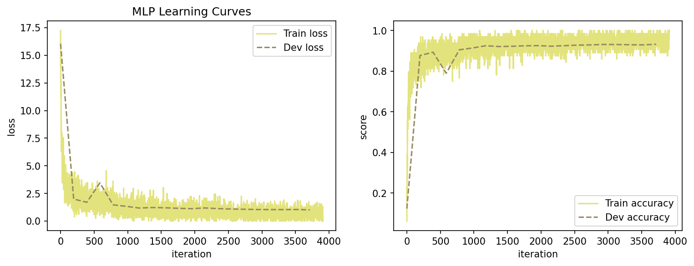
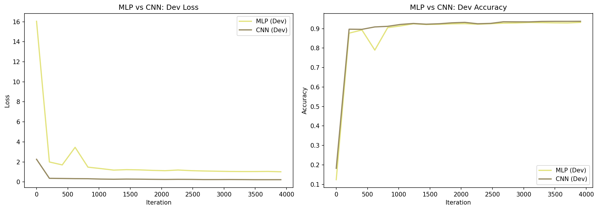
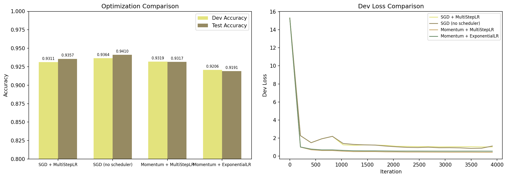
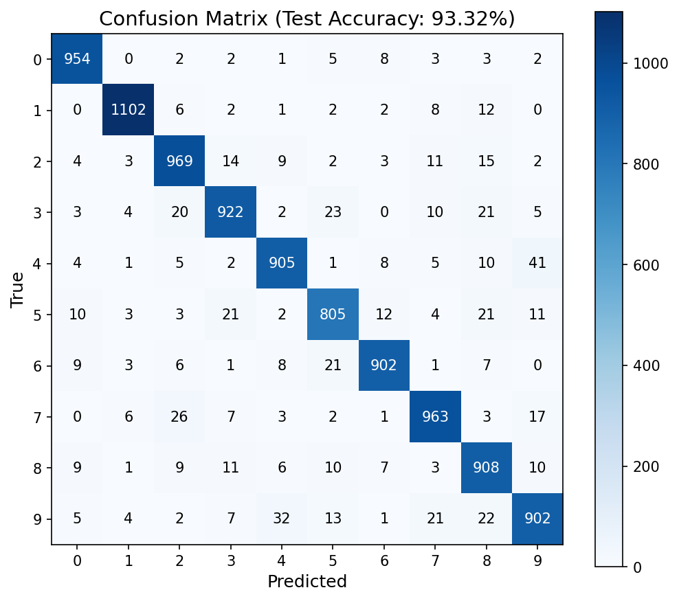
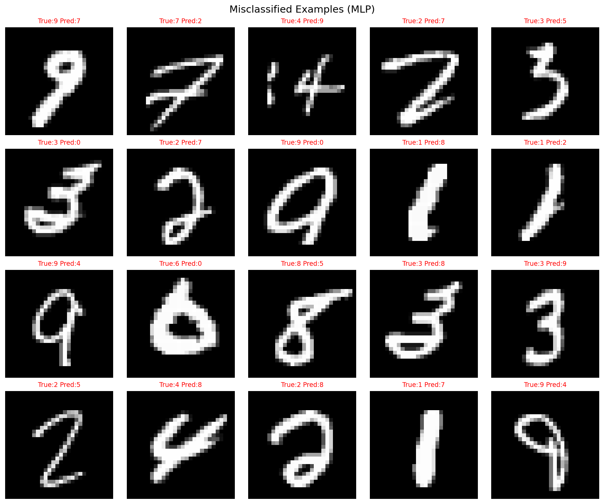
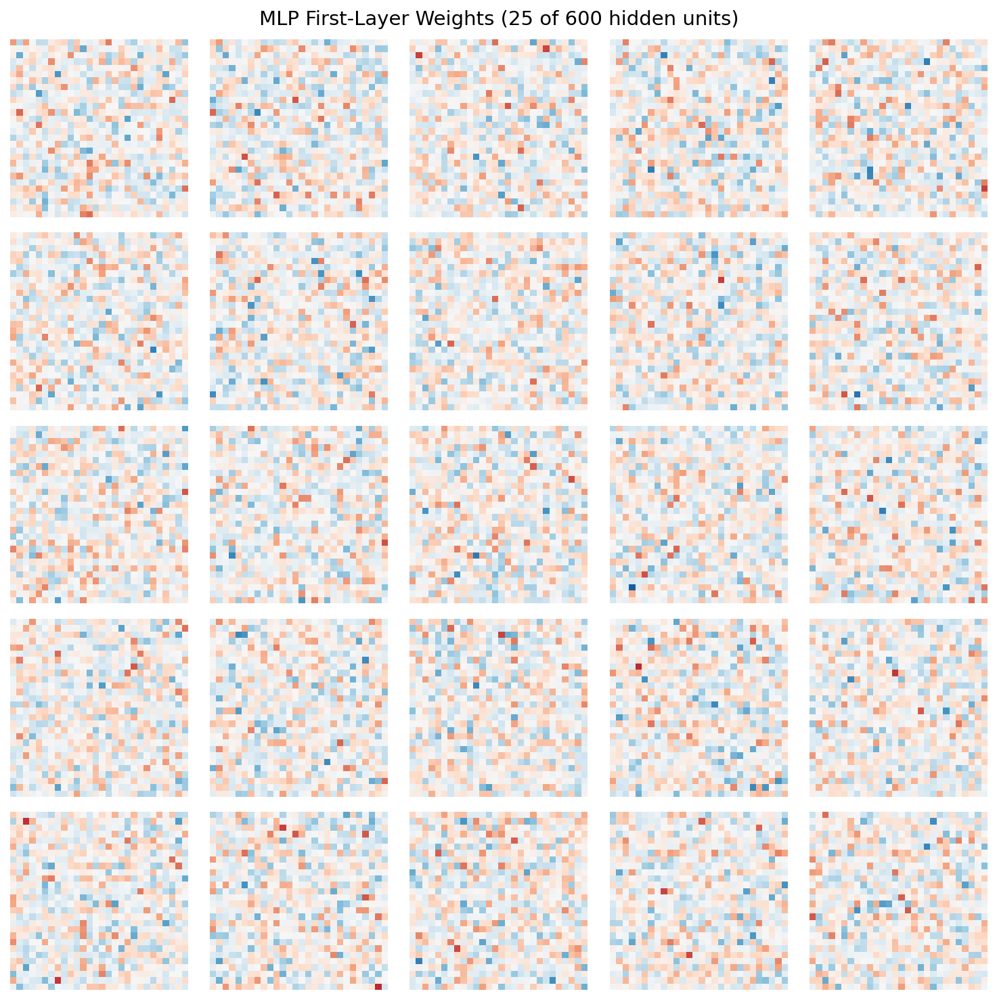

# 项目一：基于 NumPy 从零构建神经网络进行 MNIST 手写数字识别

**姓名：**[陆靖磊] &nbsp;&nbsp;&nbsp; **学号：**[22300680221]

**GitHub：**[填写 GitHub 链接] &nbsp;&nbsp;&nbsp; **模型权重：**[填写 ModelScope 链接]

---

## 摘要

本项目仅使用 NumPy 从零实现神经网络，在 MNIST 数据集上进行手写数字分类。我们实现了多层感知机（MLP）基线模型与卷积神经网络（CNN），对两者进行了系统对比，研究了不同优化策略的效果，并进行了详细的错误分析。实验结果表明：CNN 仅用 **27,090** 个参数即达到了 **94.46%** 的测试准确率，显著优于拥有 476,400 个参数的 MLP（93.32%），参数量仅为后者的 5.7%。在优化策略方面，不带学习率调度的朴素 SGD 表现最佳（测试准确率 94.10%）。错误分析显示数字 9、5、3 是最难分类的类别。

---

## 1. MLP 基线模型（Part A）

### 1.1 模型结构

我们构建了一个三层多层感知机，结构如下：

- **输入层：** 784 个神经元（28×28 的 MNIST 图像展平）
- **隐藏层：** 600 个神经元，ReLU 激活函数
- **输出层：** 10 个神经元（对应 0-9 十个数字类别）

模型可训练参数量为：784×600 + 600 + 600×10 + 10 = **476,410**。

### 1.2 核心实现

我们使用 NumPy 从零实现了以下核心算子：

**线性层（`mynn/op.py` 中的 `Linear` 类）：**

前向传播：Y = XW + b，其中 X 形状为 (B, d_in)，W 形状为 (d_in, d_out)，b 形状为 (1, d_out)。

反向传播：

$$ \frac{\partial L}{\partial W} = X^T \frac{\partial L}{\partial Y}, \quad \frac{\partial L}{\partial b} = \sum \frac{\partial L}{\partial Y}, \quad \frac{\partial L}{\partial X} = \frac{\partial L}{\partial Y} W^T $$

**交叉熵损失（`mynn/op.py` 中的 `MultiCrossEntropyLoss` 类）：**

Softmax 计算：

$$ \mathrm{softmax}(z_i) = \frac{e^{z_i - \max(z)}}{\sum_j e^{z_j - \max(z)}} $$

损失函数（负对数似然）：

$$ L = -\frac{1}{N}\sum_i \log(p_{i, y_i}) $$

Softmax 与交叉熵的联合梯度：

$$ \frac{\partial L}{\partial z} = \frac{1}{N}(p - \mathrm{onehot}(y)) $$

### 1.3 训练配置

| 超参数 | 取值 |
|---|---|
| 优化器 | SGD |
| 学习率 | 0.06 |
| 批次大小 | 64 |
| 训练轮数 | 5 |
| L2 正则化（权重衰减） | lambda = 1e-4 |
| 学习率调度器 | MultiStepLR（里程碑：800, 2400, 4000 步，gamma = 0.5） |

### 1.4 实验结果

| 指标 | 数值 |
|---|---|
| 最佳验证准确率 | 93.21% |
| 测试准确率 | **93.32%** |
| 训练时间 | 14.1 秒 |



*图 1：MLP 在 5 个训练轮次中的训练和验证损失/准确率曲线。*

从学习曲线可以看出，模型收敛平稳。验证损失从 16.2 逐步下降至约 1.0，验证准确率从 12%（随机水平）提升至 93% 以上。训练与验证指标之间的差距较小，说明模型没有出现过拟合现象——L2 正则化起到了积极作用。

---

## 2. CNN 模型及对比分析（Part B）

### 2.1 模型结构

我们使用自定义的 `conv2D` 算子构建了一个简洁的 CNN：

| 层 | 参数 | 输出形状 |
|---|---|---|
| Conv2D | 1→4 通道，卷积核 3×3，步长 1 | [B, 4, 26, 26] |
| ReLU | — | [B, 4, 26, 26] |
| Flatten | — | [B, 2704] |
| Linear | 2704 → 10 | [B, 10] |

模型可训练参数量为：1×4×3×3 + 4 + 2704×10 + 10 = **27,090**。仅为 MLP 参数量的 **5.7%**。

### 2.2 Conv2D 的实现

我们在 `mynn/op.py` 中采用**向量化的 im2col 方法**实现 `conv2D` 算子，大幅提升计算效率：

- **im2col：** 将输入中所有 k×k 的滑动窗口提取出来，排列成矩阵的列。输入张量形状 (B, C_in, H, W) 被转换为 (B × H_out × W_out, C_in × k × k) 的矩阵。
- **前向传播：** Y = im2col(X) · W_flat^T + b
- **反向传播：** 通过矩阵乘法和 `col2im`（im2col 的逆操作）高效计算梯度。

我们使用 **He 初始化**对 Conv2D 和 Linear 层进行权重初始化：

$$ W \sim N(0, \sqrt{2/n_{in}}) $$

这对于配合 ReLU 激活函数实现稳定训练至关重要。实验中发现，如果不采用 He 初始化（使用默认的标准正态分布 N(0,1) 初始化权重），CNN 完全无法训练——损失始终停留在随机猜测水平（约 2.30），准确率仅约 10%。这是因为 2704 维输入的 Linear 层在 std=1 初始化下会产生极大的 logits，导致 softmax 饱和、梯度消失。

### 2.3 MLP 与 CNN 对比

两个模型使用完全一致的训练设置进行公平对比：5 个训练轮次，SGD 优化器，学习率 0.06，批次大小 64，MultiStepLR 调度器。

| 指标 | MLP | CNN |
|---|---|---|
| 参数量 | 476,410 | **27,090** |
| 最佳验证准确率 | 93.21% | **93.77%** |
| 测试准确率 | 93.32% | **94.46%** |
| 训练时间 | 14.1s | 33.7s |



*图 2：MLP 与 CNN 的验证损失和准确率对比曲线。*

### 2.4 分析讨论

CNN 在测试准确率上比 MLP 高出 **1.14 个百分点**，同时参数量减少了 **17.6 倍**。这体现了卷积网络的两个核心优势：

1. **参数效率高：** 权重共享机制使卷积滤波器在整个图像上重复使用，每个 3×3 的卷积核学习一种局部特征检测器，应用于图像的所有位置。MLP 则需要对每个像素位置单独学习权重，大量参数被浪费在冗余的空间关系学习上。
2. **平移等变性：** CNN 的局部感受野和空间权重共享使其天然适合图像数据——某一位置学到的特征在其他位置同样有效。

CNN 的训练时间（33.7s）长于 MLP（14.1s），主要是因为 im2col 展开操作增加了矩阵运算的维度。

---

## 3. 附加方向一：优化策略对比（Part C）

### 3.1 对比方法

我们在相同的 MLP 结构上（5 轮训练，批次大小 64）对比了四种优化配置：

| 配置 | 优化器 | 学习率调度 |
|---|---|---|
| SGD（无调度） | SGD, lr=0.06 | 无 |
| SGD + MultiStepLR | SGD, lr=0.06 | 里程碑=[800, 2400, 4000], γ=0.5 |
| Momentum + MultiStepLR | MomentumGD, μ=0.9 | 里程碑=[800, 2400, 4000], γ=0.5 |
| Momentum + ExponentialLR | MomentumGD, μ=0.9 | γ=0.999（每步衰减） |

**MomentumGD** 是我们实现的动量梯度下降算法（`mynn/optimizer.py`），更新公式为：
$$v_t = \mu v_{t-1} - \eta \frac{\partial L}{\partial \theta}, \quad \theta = \theta + v_t$$

其中 $\mu$ 为动量系数，$\eta$ 为学习率。$v_t$ 累积历史梯度信息，帮助加速收敛并平滑震荡。

### 3.2 实验结果

| 配置 | 验证准确率 | 测试准确率 | 训练时间 |
|---|---|---|---|
| **SGD（无调度）** | **93.64%** | **94.10%** | 12.6s |
| SGD + MultiStepLR | 93.11% | 93.57% | 13.1s |
| Momentum + MultiStepLR | 93.19% | 93.17% | 18.9s |
| Momentum + ExponentialLR | 92.06% | 91.91% | 19.7s |



*图 3：四种优化配置的验证准确率柱状图和验证损失曲线。*

### 3.3 分析讨论

出乎意料的是，**朴素的 SGD（不带任何学习率调度）取得了最好的整体效果**（测试准确率 94.10%）。具体观察如下：

1. **SGD 优于 MomentumGD：** 动量机制通过累积历史梯度来加速收敛，但在本任务中（MNIST 上的浅层 MLP，仅训练 5 轮），额外的动量超参数（μ=0.9）带来的不稳定性可能超过了其加速收益。MomentumGD 在训练初期确实收敛更快（验证损失下降更快），但最终收敛到略低的准确率水平。

2. **MultiStepLR 拖累了 SGD，但有助于 MomentumGD：** 阶梯式学习率调度在 800、2400、4000 步将学习率减半。对 SGD 而言，这种激进的衰减策略过早降低了学习率，反而损害了性能（94.10% → 93.57%）。对 MomentumGD 而言，调度器提供了一定的收益（相比 ExponentialLR 从 91.91% 提升至 93.17%）。

3. **ExponentialLR 配合 MomentumGD 表现最差：** 缓慢的指数衰减（γ=0.999）使学习率在大部分训练过程中保持较高水平，导致模型震荡，最终获得了最差的准确率（91.91%）。

核心结论是：对于 MNIST 这类条件良好的问题配合浅层网络，**恒定的学习率配合朴素 SGD 已经足够且往往是最优的**。更复杂的优化技术在更深的网络或更困难的问题上才能充分发挥价值。

---

## 4. 附加方向二：错误分析与可视化（Part C）

### 4.1 混淆矩阵



*图 4：MLP 模型在测试集上的混淆矩阵。*

### 4.2 各类别准确率

| 数字 | 准确率 | 正确 / 总数 |
|---|---|---|
| 0 | **97.35%** | 954 / 980 |
| 1 | **97.09%** | 1102 / 1135 |
| 6 | **94.15%** | 902 / 958 |
| 2 | 93.90% | 969 / 1032 |
| 7 | 93.68% | 963 / 1028 |
| 8 | 93.22% | 908 / 974 |
| 4 | 92.16% | 905 / 982 |
| 3 | 91.29% | 922 / 1010 |
| 5 | **89.25%** | 805 / 892 |
| 9 | **89.40%** | 902 / 1009 |

**最容易分类的数字**是 0、1、6，准确率均超过 94%；**最难分类的数字**是 9、5、3，准确率均低于 91.5%。

### 4.3 错误分类样本



*图 5：随机选取的 20 个被错误分类的样本，标注了真实标签与模型预测。*

观察错误样本可以发现以下典型失败模式：

- **笔迹模糊：** 数字 4 和 9 在书写潦草时非常相似（例如，上半部分未闭合的 4 被误判为 9）。
- **数字 5 与 3 混淆：** 笔画弯曲特征相似的曲线数字经常被混淆（5 被预测为 3，反之亦然）。
- **数字 7 与 2 混淆：** 具有类似顶部笔画特征的数字偶尔被混判。
- **数字 8 与 5/3 混淆：** 具有类似环形结构的数字容易发生混淆。

### 4.4 权重可视化



*图 6：MLP 第一层权重的可视化（600 个隐藏单元中的 25 个），将每个权重向量重塑为 28×28。*

第一层权重揭示了有意义的特征模式：
- 部分神经元学习了**笔画探测器**（斜线、曲线、环形图案）。
- 另一些神经元学习了类似**整字模板**的模式。
- 权重矩阵中同时存在**兴奋性区域**（红色，正权重）和**抑制性区域**（蓝色，负权重），说明神经元学会了通过正负权重配合来检测特征。
- 600 个隐藏单元学习的特征多样性使得模型能够稳健地识别各类数字。

---

## 5. 主要结果汇总表

| 部分 | 模型/实验 | 参数量 | 验证准确率 | 测试准确率 |
|---|---|---|---|---|
| A | MLP 基线（784→600→10, ReLU） | 476,410 | 93.21% | 93.32% |
| B | **CNN（Conv2D + Linear）** | **27,090** | **93.77%** | **94.46%** |
| C1 | SGD（无调度）——最优优化器 | 476,410 | 93.64% | 94.10% |
| C1 | SGD + MultiStepLR | 476,410 | 93.11% | 93.57% |
| C1 | Momentum + MultiStepLR | 476,410 | 93.19% | 93.17% |
| C1 | Momentum + ExponentialLR | 476,410 | 92.06% | 91.91% |
| C5 | 错误分析（MLP） | 476,410 | — | 93.32% |

---

## 6. 综合讨论

### 为什么 CNN 比 MLP 更适合图像分类？

CNN 的局部感受野和权重共享机制提供了两个关键优势：（1）**空间局部性**——相邻像素之间的相关性更强，卷积滤波器通过局部特征学习充分利用了这一特性；（2）**平移等变性**——在一个位置学到的特征检测器在其他位置同样有效。相比之下，MLP 将每个输入像素独立处理，相同模式出现在不同位置时必须分别学习不同的权重，严重浪费模型容量。本实验中 CNN 仅用不到 MLP 6% 的参数就超越了其准确率，充分验证了这一观点。

### CNN 是否提升了验证或测试准确率？

是的。CNN 将测试准确率提升了 **1.14 个百分点**（93.32% → 94.46%），同时参数量减少了 **17.6 倍**。这充分说明了卷积归纳偏置在图像任务中的有效性。

### 为什么选择这两个附加方向？

我们选择了 **（1）优化策略对比**和 **（2）错误分析与可视化**。优化策略是训练流程的自然延伸，我们希望探究动量和学习率调度是否能够改进基线模型。错误分析则帮助我们理解模型的弱点和失败模式，提供超越单一准确率数字的可解释性。同时，代码中已经实现了 MomentumGD、MultiStepLR、ExponentialLR 等模块，选择优化方向可以充分复用已有工作。

### 哪项改动或分析最具启发性？

**CNN 与 MLP 的对比**最具启发性。它清晰地表明：在图像分类任务中，架构的归纳偏置比原始参数量更为重要。CNN 用极少参数就实现了更高准确率，直观诠释了深度学习的核心思想——正确的结构优于更多的参数。

### 哪些样本对模型来说仍然困难？

数字 **9、5 和 3** 仍然是最具挑战性的类别（准确率均低于 91.5%）。这些数字共享类似的曲线和环形笔画特征。常见的混淆包括：9↔4（上半部分结构相似），5↔3（弯曲笔画相似），以及 7↔2（顶部特征相似）。要提升这些数字的分类准确率，可能需要引入数据增强（小角度旋转、弹性形变）或使用更深层的网络结构。

---

## 参考文献

- MNIST 数据集：LeCun, Y., Cortes, C., & Burges, C. (1998). The MNIST Database of Handwritten Digits.
- He 初始化：He, K., Zhang, X., Ren, S., & Sun, J. (2015). Delving Deep into Rectifiers: Surpassing Human-Level Performance on ImageNet Classification.
- 交叉熵与 Softmax：Goodfellow, I., Bengio, Y., & Courville, A. (2016). Deep Learning. MIT Press.

---

## 附录：代码结构

```
codes/
├── mynn/
│   ├── op.py              # Linear, Conv2D, ReLU, Flatten, MultiCrossEntropyLoss
│   ├── models.py          # Model_MLP, Model_CNN
│   ├── optimizer.py       # SGD, MomentumGD
│   ├── lr_scheduler.py    # StepLR, MultiStepLR, ExponentialLR
│   ├── runner.py          # 训练循环与评估
│   └── metric.py          # 准确率计算
├── test_train.py          # MLP 训练脚本
├── test_model.py          # 模型评估脚本
├── run_all_experiments.py # 综合实验脚本
└── experiment_results/    # 所有结果、图表和模型文件
```

---
